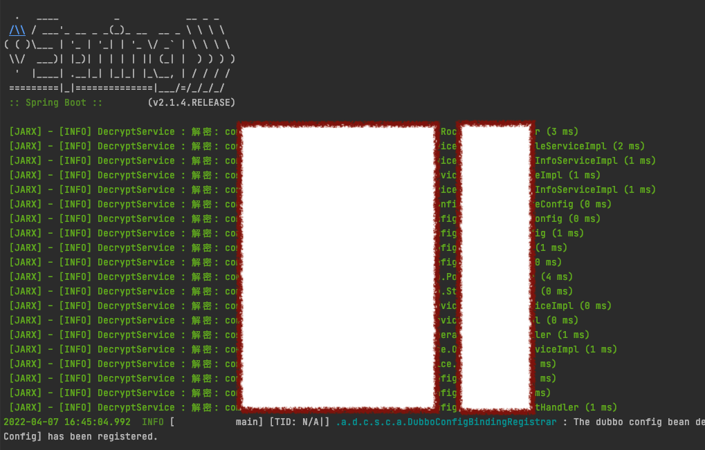
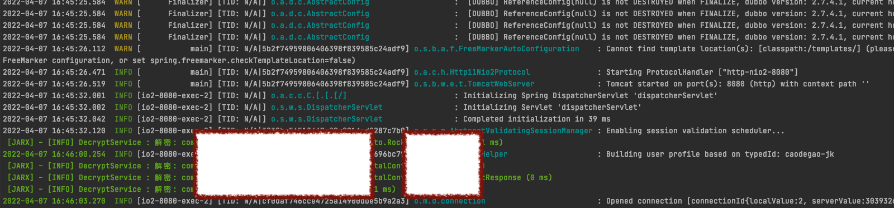

---

title: "Jar包加固《三、Agent开发》"
layout: post
author: 曹德高
tags: [java]
categories: Java
---

### 前言

Jar包的加密已经完毕了，现在开始做Jar包的解密开发，javaagent的开发工作量不多，只有是解密文件还原给应用使用。

### agent加载问题注意

开发加密Jar包的时候我的规划是文件操作的代码规划到core包里面，可以依赖一些方便的工具如：Apache common-land、io。guava等，而crypto包只用jdk提供的类提供加密的方法，RSE和AES都能满足了，文件操作也可以用io包解决，因为agent解密只要依赖crypto的包，不会依赖core包。

agent最好不要依赖第三方包，除非你全部重写过第三方包和包名，否则容易出现传递依赖包冲突问题，比如你在agent包中用了guava的3.x版本，但是应用的包依赖的是guava的2.x版本，3.x版本删除过某个2.x版本的class，那么别人应用中用了这个类就会报错，因为传递依赖的时候agent是把2.x的代码打到他的class下面的，发现在agent有的情况下会优先用agent包内加载的代码，这点在写agent jar的时候是需要很谨慎的。

大家有兴趣可以了解一下skywalking源码，它的agent虽然有用第三方包但是打包的pom都排除掉了，仅利用应用里面懒加载的jar依赖传递，就是避免用了它的agent启动不会因为全类名一致导致代码冲突，并且skywalking中你用了什么功能它才会被激活，一旦被激活，你的jar包肯定是有该依赖，这也是它的厉害之处。

如果你的agent要用尽量都用<scope>provided</scope>来声明依赖，agent都去使用应用加载的第三方包。**但注意，如果应用里面都没依赖过这个包，那启动的时候一用到这个包的类就异常了。**

### javaagent流程

我们加密的时候是把原始密码和Mac地址群分别放在Pass和Code文件里面，那么我们解密的时候是需要用到RSA私钥，那这个私钥存哪里也是个问题，目前暂定存放到环境变量中，如果觉得不稳妥，那就必须要在agent里面开发一个http去第三方配置中心取私钥了。

http接口是<可选>逻辑。

得到私钥后到META-INF下面找Pass和Code解密得到原始密码和判断是否有Mac地址授权判断。

```
public static void premain(String args, Instrumentation inst) {
  。。。。。。
  //解密后重新定义Class：
  AgentTransformer tran = new AgentTransformer(password);
  inst.addTransformer(tran);
}
```

Transformer类中根据className到META-INF/xxxClasses文件夹下寻找对应的类，如果存在就进行解密返回新的byte[]，如果没有就返回原始byte[]。这里有个特殊的校验，即如何知道解密回来的文件是正常的class文件，如果你的文件被破坏了，可能就不是class文件，或者你的文件加密的时候是用txt格式内容，这里可能会转换错误的风险，我找了一些资料发现文件类型是有一个值可以区分的，就比如java文件有一个魔数，每个class文件前4个字节是CAFEBABE，Java语言的创始人设置的，爱喝咖啡的人有故事。

所以我只要判断是否为正常的class文件则解密正确，也保证的还原了文件，毕竟加密有问题就会导致整个包都不可用风险系数极高。

```
@Override
public byte[] transform(ClassLoader loader, String className, Class<?> classBeingRedefined,
                        ProtectionDomain domain, byte[] classBuffer) {
  if (className == null || domain == null || loader == null) {
    return classBuffer;
  }

  byte[] bytes = DECRYPT_UTILS.decode(projectPath, className, this.password);
  if (bytes == null) {
    return classBuffer;
  }
  if (isJavaMagicNumber(bytes)) {
    return bytes;
  } else {
    LOG.warn("解密到的文件格式非JAVA格式 :" + className);
  }
  return classBuffer;
}

private static final byte CA = -54;
private static final byte FE = -2;
private static final byte BA = -70;
private static final byte BE = -66;

/**
 * 魔数占四个字节
 */
private boolean isJavaMagicNumber(byte[] bytes) {
  return bytes[0] == CA && bytes[1] == FE && bytes[2] == BA && bytes[3] == BE;
}
```

### 禁用Attach

**-XX:+DisableAttachMechanism**

深度使用java的人基本都会用诊断功能如arthas工具，如何禁用其他工具attach到本进程呢？启动时加这个参数即可。

但是加这个参数意味这你放弃使用jcmd、jstack、jmap和jinfo等命令，因为该命令不允许工具与JVM连接。

### 启动效果

无论是懒加载或非懒加载，类被加载时都会先经过agent，agent作为应用的门卫角色，class被应用使用之前都会被优先校验或替换过。





